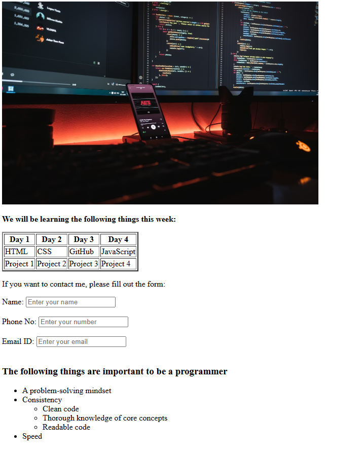

#  Weekly Learning Plan – HTML Portfolio Project

A thoughtfully structured **HTML5 webpage** created to demonstrate core web development fundamentals. This project highlights clean markup, semantic structure, and accessibility best practices—serving as a solid foundation piece for a front-end development portfolio.

---

##  Introduction

  This project presents a **Weekly Learning Plan** for aspiring programmers using **pure HTML**. It reflects an understanding of how to organize content clearly and meaningfully without relying on styling or scripting technologies.

The goal of this project is to showcase **HTML proficiency**, code readability, and proper document structure.

---

##  What This Project Demonstrates

* Strong understanding of **HTML5 fundamentals**
* Clean, well-indented, and readable markup
* Proper use of:

  * Tables for structured data
  * Forms for user input
  * Labels for accessibility
  * Nested lists for content hierarchy
* Attention to semantic correctness and usability
* Ability to build complete static pages using only HTML

---

##  Tech Stack

* **HTML5**

  * No CSS
  * No JavaScript
  * No frameworks or libraries

This emphasizes a solid foundation before moving on to advanced technologies.

[Live](https://liveabhi009.github.io/Weekly-Learning-Plan/)


---

##  Repository Structure

```
 weekly-learning-plan
 ┣ 📄 index.html
 ┗ 📄 README.md
```

---

##  How to View the Project

1. Clone or download the repository
2. Open `index.html` in any modern web browser
3. Review the layout, structure, and HTML implementation

This project runs entirely in the browser with no setup required.

---

##  Purpose & Learning Outcomes

This project was built to:

* Reinforce core HTML concepts
* Practice structuring real-world content
* Develop habits for writing clean and maintainable code
* Serve as an entry-level portfolio project for front-end development

---

##  Possible Next Steps

Future iterations of this project may include:

* Styling with CSS for improved visual presentation
* JavaScript for form validation and interactivity
* Responsive design improvements
* Deployment using GitHub Pages

---

##  About the Developer

**ABHINAV ABIN**
Front-End Developer in Progress
Focused on building strong fundamentals in web development

---

##  License

This project is open for learning and portfolio use.
Feel free to explore, fork, and adapt.

---
